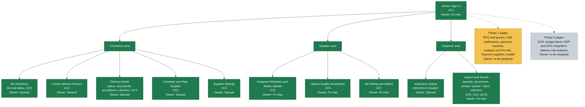

# SiteProof

**Smart Delivery & Supplier Management Platform** for general contractors and material suppliers in Taiwan.

SiteProof focuses on one workflow, the **Material Delivery Closed-Loop**: a contractor schedules a delivery, the supplier updates its status and uploads quality documents, a site inspector accepts (fully, partially) or rejects it, and the system calculates retention and records a 1–5 supplier rating. Everything lives in **one single delivery record**.

Course project for *Software Engineering in Construction Information Systems* (CT5805701, NTUST).

## Team

| Member | Student ID | Role |
|---|---|---|
| 鄭博浩 | M11505503 | Software Engineer / System Architect |
| A. Samuel Arzamendia | M11405807 | Business Analyst & Quality Control |

## Website organization chart

The chart shows the planned pages of the web application, who is responsible for each one, and the implementation priority (fill color).

### Priority legend

| Color | Priority | Scope |
|---|---|---|
| 🟩 Green | 1 — build first | Phase 1 MVP (the five must-have functions) |
| 🟨 Yellow | 2 — build next | Phase 2 expansion |
| ⬜ Grey | 3 — build later | Phase 3 intelligence |

### Responsibilities

| Page | Use case | Priority | Owner |
|---|---|---|---|
| Home / Sign in | UC1 | 1 | Po-Hao |
| My Deliveries | UC3 | 1 | Samuel |
| Create Delivery Record | UC2 | 1 | Samuel |
| Delivery Detail | UC3 | 1 | Samuel |
| Complete and Rate Supplier | UC4 | 1 | Samuel |
| Supplier Ratings | UC3 | 1 | Samuel |
| Assigned Deliveries and Status Update | UC5 | 1 | Po-Hao |
| Upload Quality Documents | UC6 | 1 | Po-Hao |
| My Rating and History | UC7 | 1 | Po-Hao |
| Inspection Queue | UC8 | 1 | Samuel |
| Inspect and Decide | UC8, UC9, UC10 | 1 | Po-Hao |
| Phase 2 and Phase 3 pages | — | 2 / 3 | To be assigned |
